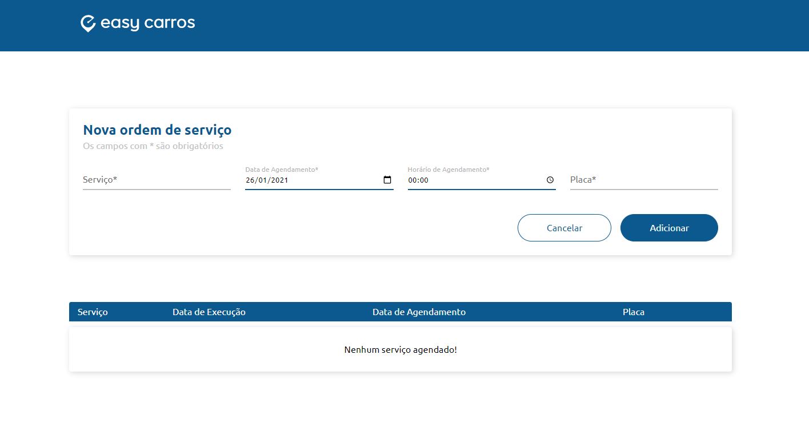

<br />
<p align="center">
  
  <h3 align="center">Easy Carros</h3>

  <p align="center">
    Sistema de agendamento de serviços automotivos.
    <br />
    <a href="https://easy-carros-leticia.netlify.app/"><strong>Veja o site online »</strong></a>
    <br />
    <br />
  </p>
</p>

## 📌 Índice

- [Sobre o projeto](#sobre)
  - [Feito com](#feito)
- [Iniciando o projeto](#iniciando)
  - [Pré-requisitos](#requisitos-minimos)
  - [Instalação](#instalacao)
- [Contato](#contato)

## 💻 Sobre o projeto <a name="sobre"></a>

<p align="center">
  
</p>

<p>Esse projeto é um CRUD de serviços automotivos, nele é possível agendar, excluir e finalizar um serviço agendado. Para agendar um serviço basta informar no nome do serviço desejado, data, horário e placa do veículo e ao adicionar um agendamento ele é automoticamente listado na lista abaixo de serviços agendados. Ao clicar em finalizar é possível escolher qual foi o horário e data da execução do serviço. Todos os agendamentos ficam salvos no localStorage sendo removido apenas ao excluir o serviço.</p>

#### Features:

- Agendar Serviço
- Finalizar Serviço
- Apagar Serviço

### 📝 Feito com <a name="feito"></a>

- [JavaScript ES6](http://es6-features.org/)
- [React](https://reactjs.org/)
- [Styled-components](https://styled-components.com/)

## 🎉 Iniciando o projeto <a name="iniciando"></a>

Para clonar e instalar o projeto em sua máquina, siga os passos abaixo.

### ❗ Pré-requisitos <a name="requisitos-minimos"></a>

Para rodar o projeto é necessário ter o <a href="https://nodejs.org/en/download/">Node</a> instalado na sua máquina.

### 📥 Instalação <a name="instalacao"></a>

1. Clone o repositório

```sh
git clone https://github.com/leticiafrontend/easy-carros.git
```

2. Instale as dependências rodando o comando

```sh
yarn install
```

3. Digite o comando para ligar o servidor

```JS
yarn start
```

4. Acesse a URL http://localhost:3000/

## 📱 Contato <a name="contato"></a>

Letícia Silva - [LinkedIn](https://www.linkedin.com/in/leticia-alexandre/) - leticia.alesilva@outlook.com - [WhatsApp](https://api.whatsapp.com/send?phone=5511940106659)

Outros projetos: [https://github.com/leticiafrontend/](https://github.com/leticiafrontend/)
<br>
<br><br>
